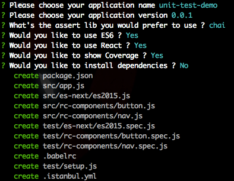

# generator-tman
> 前端单元测试脚手架，支持 es6、react

## 安装

```bash
npm install -g generator-tman
```

## 初始化项目

```bash
cd /your-repo/dir
yo tman
```

## 运行截图


## 运行示例

* 不展示覆盖率信息

```bash
npm test
```

* 展示覆盖率信息

```bash
npm run coverage
```


## License

* MIT
